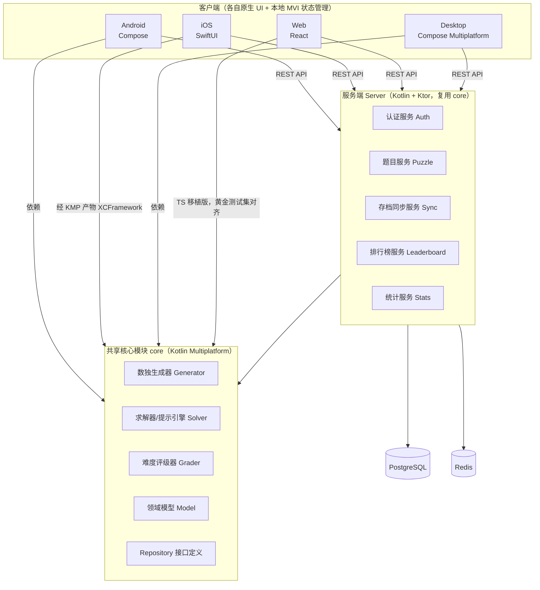
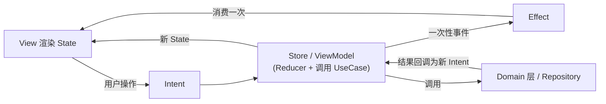
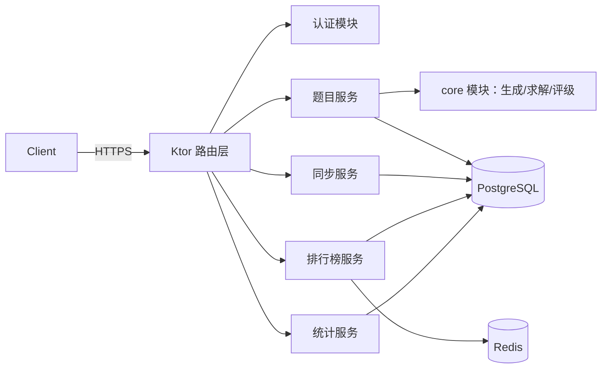

# 数独游戏全平台研发策划书

> 版本：v1.0　|　日期：2026-06-23　|　适用范围：Android / iOS / Web / Desktop / Server
> 架构基线：MVI（Model-View-Intent）+ 跨平台共享核心逻辑

## 文档说明

本文档的目标是给出一份**可以直接拆解给 AI 编程工具（如 Claude Code）按模块执行**的完整研发策划，覆盖游戏设计、整体技术架构、核心算法、数据/接口设计、各端工程结构、开发计划与测试策略。文档中的伪代码、数据结构、接口定义、目录结构均可作为开发任务的输入直接使用。

**关键默认假设**（这些是为了让文档可执行而做出的设定，使用前请确认或调整）：

1. 商业化方向：**免费下载 + 非强制广告 + 内购去广告/主题包**。不设置强制付费墙、不做体力值/抽卡类强迫付费设计。
2. 服务端技术栈：**Kotlin + Ktor**，理由是可以与 Android / Desktop / Server 共享同一套核心算法代码（生成器、求解器、难度评级器），iOS 通过 Kotlin Multiplatform 编译产物复用，最大程度减少"同一逻辑写五遍"的风险，这对 AI 辅助开发尤其重要（核心逻辑只需要测一次、改一次）。
3. 默认棋盘规格为标准 **9×9**，4×4/6×6/12×12 作为 v2 的可扩展项预留接口，不在 MVP 范围内。
4. 跨平台代码复用策略：**Kotlin Multiplatform（KMP）下沉核心领域逻辑**，UI 层各平台原生实现（Compose / SwiftUI / React / Compose Desktop）。Web 端是否直接消费 KMP 编译的 Wasm/JS 产物，还是维护一份 TypeScript 平行实现，文档第四部分给出两种方案对比及推荐。

---

## 目录

- 一、产品概述
- 二、游戏玩法设计
- 三、整体技术架构与 MVI 详解
- 四、核心领域逻辑设计（算法层，可共享）
- 五、数据存储设计
- 六、服务端设计
- 七、各端详细工程设计（Android / iOS / Web / Desktop）
- 八、工程目录结构（Monorepo）
- 九、开发计划与里程碑
- 十、测试策略
- 十一、AI 协同开发指引
- 附录

---

## 一、产品概述

### 1.1 产品定位

一款跨平台（手机 + 网页 + 桌面）的数独游戏，强调：**规则严谨的题目生成与求解、可解释的提示系统、跨设备进度同步、轻量但耐玩的激励体系**。不做强叙事、不做重社交，定位为"高质量工具型休闲游戏"，对标 Sudoku.com / AGED Sudoku 一类产品，但工程上以**单一核心逻辑驱动多端**为差异化优势。

### 1.2 目标用户与场景

| 用户画像 | 典型场景 | 核心需求 |
|---|---|---|
| 通勤/碎片时间玩家 | 地铁、排队、睡前 | 快速进入一局，单局 3–15 分钟可完成 |
| 数独爱好者/硬核玩家 | 专门坐下来挑战高难度 | 高难度题目、详细的技巧统计、无干扰模式 |
| 怀旧/长辈用户 | 桌面端、平板，长时间使用 | 大字体、低眼疲劳配色、简单的撤销/提示 |
| 多设备用户 | 手机开局，电脑/平板续玩 | 进度云同步、跨端一致体验 |

### 1.3 平台范围与优先级

| 平台 | 技术方向 | 开发优先级 |
|---|---|---|
| Android | Kotlin + Jetpack Compose | P0（首发） |
| iOS | Swift + SwiftUI | P0（首发） |
| Web | TypeScript + React | P1 |
| Desktop（Win/macOS/Linux） | Kotlin Compose Multiplatform Desktop | P2 |
| Server | Kotlin + Ktor | P0（与移动端同步上线，否则云存档/每日挑战无法工作） |

> 说明：Server 虽然用户不可见，但因为"每日挑战"和"跨端同步"两个功能强依赖它，优先级必须与移动端首发对齐，不能后置。

### 1.4 核心卖点

1. **可解释提示**：点击提示后不是直接填数字，而是说明"为什么这格必须是 X"（基于人类解题技巧的推理链），帮助玩家学习而不是纯依赖。
2. **难度可信**：难度分级基于真实解题技巧复杂度评分，而不是简单按挖空数量分级，保证"专家"难度真的需要高级技巧。
3. **多端进度无缝衔接**：同一账号在手机做到一半，换电脑可以从同一格继续，笔记、撤销历史、计时都保留。
4. **每日挑战公平性**：所有平台用户同一天看到完全相同的题目，排行榜可信。

### 1.5 非目标（明确不做的事，避免范围蔓延）

- 不做实时对战/PVP。
- 不做强叙事/角色养成。
- 首发不做社交好友系统（好友排行榜留作 v2）。
- 首发只做 9×9 标准数独（其他变体留作 v2 扩展点，但架构要预留）。

---

## 二、游戏玩法设计

### 2.1 数独规则基础（用于和 AI 对齐"判定规则"）

- 9×9 棋盘分为 9 个 3×3 宫；每行、每列、每宫必须包含数字 1–9 且不重复。
- 题目给定部分初始数字（"题目数"，不可修改），玩家填充剩余空格。
- 合法的完整解对一个给定题目应当**唯一**（生成阶段强制校验，避免出现多解题目）。

### 2.2 难度体系设计

难度不是按空格数量粗暴分级，而是基于"解开这道题最少需要用到的最高级技巧"来定级。技巧分层定义在第四部分给出算法实现，这里给出难度→技巧的映射表（初始参数，建议上线前用实测数据微调）：

| 难度等级 | 求解所需最高技巧 | 9×9 典型空格数 | 目标用户 |
|---|---|---|---|
| 入门 Easy | 唯一余数（Naked Single）、单元唯一（Hidden Single） | 36–40 | 新手/儿童 |
| 简单 Medium | + 数对摒除（Naked/Hidden Pair） | 32–36 | 休闲玩家 |
| 普通 Hard | + 区块摒除（Pointing Pairs / Box-Line Reduction） | 28–32 | 进阶玩家 |
| 专家 Expert | + X-Wing / 鱼形（Swordfish） | 24–28 | 高手 |
| 大师 Master | + XY-Wing 等链式技巧，或需要试探搜索 | 22–26 | 硬核玩家 |

### 2.3 游戏模式（MVP 范围标注）

| 模式 | 说明 | MVP |
|---|---|---|
| 经典模式 | 任选难度，单局制，无时间惩罚 | ✅ |
| 每日挑战 | 每天一题，全平台同题，可上传成绩到排行榜 | ✅ |
| 计时挑战 | 同经典模式但显示成绩排名，鼓励比拼速度 | ✅（与经典模式共用引擎，仅 UI 差异） |
| 无尽模式（连续出题） | 完成一题自动出下一题，统计连续完成数 | v2 |
| 关卡/谜题书模式 | 预设题目集合，带特殊规则（如对角线数独） | v2 |

### 2.4 核心交互设计

- **输入方式**：选中格子 → 点击数字面板输入；支持"先选数字再点格子"的反向输入习惯（设置项可切换默认模式）。
- **笔记模式（候选数模式）**：切换后输入数字记为候选数（角标小数字），再次点击切回正常输入。
- **自动候选数**：可选开启"自动计算并显示候选数"，降低硬核玩家手记负担（默认关闭，保持挑战性）。
- **错误高亮**：可选开启"实时检查"，输入后若与解答冲突立刻标红；也可选择"提交时才检查"模式。
- **撤销/重做**：完整的操作历史栈，支持无限步撤销（直到题目初始状态）。
- **错误次数限制**：可选模式——默认"自由模式"无限制；"竞技模式"错误 3 次判定失败（用于排行榜公平性，避免无限试错刷分）。

### 2.5 辅助系统设计

提示系统分三级，消耗"提示币"（免费玩家每日免费次数 + 内购可购买）：

1. **指方向**：高亮一个格子，告诉玩家"这格可以确定了"，不直接给数值。
2. **给技巧名**：告诉玩家用到的技巧名称（如"这一行用排除法"），不展开推理过程。
3. **给推理链**：完整展开为什么（"第 3 行已有 1,2,4,5,7,8,9，因此第 6 列第 3 行必须是 3 或 6；结合第 6 列宫内已排除 6，得出该格为 3"）。

### 2.6 进度与数据系统

记录并展示：总完成局数、各难度最佳用时、当前连续每日挑战打卡天数（streak）、历史正确率（无错通关占比）、累计游戏时长、技巧使用分布（用于给玩家"你最常用到 X-Wing"之类的画像，增加成就感）。

### 2.7 成就系统（示例集，可扩充）

| 成就 | 达成条件 |
|---|---|
| 初出茅庐 | 完成第一局 |
| 零失误 | 一局零错误通关 |
| 闪电手 | Easy 难度 3 分钟内通关 |
| 连续打卡 7 天 | 每日挑战连续完成 7 天 |
| 大师之路 | 完成一局 Master 难度 |
| 不求人 | 累计 50 局不使用提示通关 |

### 2.8 主题与个性化

- 浅色/深色/跟随系统三种模式（MVP 必须支持深色模式，移动端用户夜间使用占比高）。
- 配色主题包（内购解锁，默认提供 1–2 套免费主题）。
- 字体大小档位（小/中/大/特大），服务长辈用户群体。
- 数字输入面板布局可选（横排/网格）。

### 2.9 音效与反馈

放置数字、出错、通关、连击（连续正确）四类基础音效；震动反馈（移动端，出错时短震动）；动效：通关时整盘数字短暂高亮波纹动画，不做夸张特效以保持"工具感"调性。

### 2.10 新手引导

首次启动提供一次"强制不可跳过的最小化教学"：选格→输入数字→撤销→提示，4 步以内完成，时长控制在 30 秒以内，避免过度引导流失。

### 2.11 商业化设计

- **广告**：仅在"完成一局后"和"主动点击免费提示获取额外次数"两个节点展示插屏/激励视频广告，不打断正在进行的解题过程，不做强制观看才能继续的设计。
- **内购**：
  - 去广告（一次性买断）
  - 主题包（单独购买或主题包订阅）
  - 提示币�所购买包
- 明确不做：体力值限制每日可玩局数、强制付费才能解锁难度。这类设计会破坏"工具型休闲游戏"的产品调性。

### 2.12 无障碍设计

- 色盲模式：用形状/纹理区分而非仅靠颜色区分"题目数字 vs 玩家输入 vs 错误"。
- 动态字体缩放跟随系统设置。
- 移动端支持 TalkBack / VoiceOver 朗读格子坐标与当前数值。
- 触感反馈强度可在设置中关闭（部分用户对震动敏感）。

### 2.13 国际化（i18n）

文案、数字格式、日期格式（影响"每日挑战"按用户时区还是统一 UTC 日期发放，建议**统一按 UTC 日期发放**并在 UI 显示本地倒计时，避免跨时区作弊或体验割裂）需要从架构层面用 key-value 资源文件设计，不要在代码中硬编码中文/英文字符串。
## 三、整体技术架构与 MVI 详解

### 3.1 架构总览



**关键设计原则**：数独生成、求解、难度评级这些"规则严谨、易出 bug、需要重度测试"的逻辑只写一份（Kotlin Multiplatform 的 `core` 模块），Android/Desktop/Server 直接编译复用，iOS 通过 KMP 产出的 XCFramework 调用。Web 端因生态原因（招聘、生态库、SSR 等考量）推荐维护一份 TypeScript 平行实现，但**所有语言实现必须通过同一套"黄金测试集"**（见 4.7 节）校验行为一致，避免五端出现"同一题目不同端难度不一样"的尴尬问题。

### 3.2 技术选型矩阵

| 平台 | UI 框架 | 状态管理（MVI 落地） | 本地存储 | 网络 |
|---|---|---|---|---|
| Android | Jetpack Compose | 自实现 Store（StateFlow + sealed Intent） | Room | Ktor Client / Retrofit |
| iOS | SwiftUI | 自实现 Store（ObservableObject + Combine/Swift Concurrency） | SwiftData | URLSession / Alamofire |
| Web | React + TypeScript | Redux Toolkit（天然契合 MVI：Action=Intent, Reducer=Reducer, Store=Model） | IndexedDB（通过 Dexie.js） | fetch / axios |
| Desktop | Compose Multiplatform Desktop | 与 Android 共享 Store 实现（同为 Kotlin） | SQLite（SQLDelight） | Ktor Client |
| Server | Ktor | — | — | — |
| 数据库（Server） | — | — | PostgreSQL + Redis | — |

> Desktop 与 Android 的 UI 都基于 Compose，理论上可以做到 **UI 代码也大比例共享**（Compose Multiplatform 支持 `commonMain` 中编写共享 Composable），本文档建议：核心交互组件（棋盘格、数字面板、提示弹窗）下沉到共享 UI 模块，桌面专属的窗口管理、菜单栏、快捷键单独实现。

### 3.3 MVI 架构详解

#### 3.3.1 核心概念

MVI（Model-View-Intent）是一种单向数据流架构，四个核心角色：

- **Intent**：用户操作或外部事件的"意图"，用密封类/枚举建模，是不可变的事件描述（例如 `SelectCell`、`InputNumber`、`RequestHint`）。
- **State**：某一时刻 UI 需要的全部信息，是**单一不可变数据类**（Single Source of Truth），View 只依据 State 渲染，不持有自己的局部状态。
- **Reducer/Processor**：纯函数，输入 `(当前 State, Intent)`，输出`新 State`（或者输出一组 Effect 描述需要执行的副作用，再异步把结果转成新的 Intent 喂回去）。
- **Effect（一次性事件）**：不属于 State 但需要执行一次的副作用，如弹窗、跳转、播放音效、震动。State 是"可重复渲染的快照"，Effect 是"只消费一次的事件流"，两者必须分开，否则会出现"切换深色模式后弹窗又弹了一次"之类的 bug。

#### 3.3.2 单向数据流



#### 3.3.3 与 MVVM 的关键区别（写给 AI 开发者，避免实现时退化成 MVVM）

| 维度 | MVVM（常见误用） | MVI（本项目要求） |
|---|---|---|
| State 数量 | 多个零散的 `LiveData`/`@Published` 字段 | **唯一**一个 State data class |
| 修改方式 | View 直接调用 ViewModel 方法改字段 | View 只能 dispatch Intent，Reducer 统一处理 |
| 一次性事件 | 常被错误地塞进 State 字段，导致重复触发 | 单独的 Effect 流，消费后即丢弃 |
| 可测试性 | 依赖具体方法调用顺序 | 纯函数 Reducer，输入输出可直接断言，易写单元测试 |

#### 3.3.4 各平台 MVI 落地范式

**通用接口形状（伪代码，各平台按语言习惯翻译）：**

```kotlin
interface MviStore<S : Any, I : Any, E : Any> {
    val state: StateFlow<S>      // 当前状态（可观察）
    val effects: Flow<E>          // 一次性事件流
    fun dispatch(intent: I)       // 唯一的输入口
}
```

- **Android**：`GameViewModel : ViewModel(), MviStore<GameState, GameIntent, GameEffect>`，内部用 `MutableStateFlow` 持有 State，用 `Channel`（`Channel.BUFFERED`）承载 Effect 避免丢失。Reducer 是 `ViewModel` 内的私有纯函数 `reduce(state, intent): Pair<State, List<Effect>>`。
- **iOS**：`final class GameStore: ObservableObject`，`@Published private(set) var state: GameState`，Effect 用 `PassthroughSubject<GameEffect, Never>` 或 Swift Concurrency 的 `AsyncStream`。SwiftUI View 通过 `@StateObject`/`@ObservedObject` 订阅。
- **Web**：用 Redux Toolkit 的 `createSlice` 直接对应 Reducer；Effect（一次性副作用）用 `redux-observable` 的 Epic 或简单的 `useEffect` + 一个"事件队列" slice 模拟（Redux 原生没有内建的一次性事件机制，需要约定：Effect 用完即 `dispatch` 一个 `consumeEffect` Action 清空）。
- **Desktop**：与 Android 共享同一套 `MviStore` 抽象（同为 Kotlin/JVM），可以直接复用 Android 的 Store 实现，仅 Composable UI 层针对桌面窗口尺寸做适配。

#### 3.3.5 分层结构（贯穿各端）

```
View（Compose/SwiftUI/React 组件，只读 State + dispatch Intent）
  ↓ ↑
Store/ViewModel（MVI 状态机：Intent → Reducer → State / Effect）
  ↓ ↑
Domain（UseCase：业务规则，平台无关，理想情况下整段就是 core 模块代码）
  ↓ ↑
Data（Repository 实现：本地 DB + 远程 API，平台相关）
```

各层职责边界（给 AI 任务拆解用）：

- **View 层**：禁止出现业务逻辑判断（例如"难度等于 Master 才显示某按钮"这种条件可以在 View 里写，但"判断当前填的数字是否合法"绝对不能在 View 层写，必须调用 Domain）。
- **Store 层**：禁止直接发网络请求/读数据库，必须通过注入的 Repository 接口。
- **Domain 层（即 core 模块）**：不依赖任何平台 SDK，纯 Kotlin（或对应语言）逻辑，可以单独跑单元测试不需要模拟器/浏览器环境。
- **Data 层**：实现 Domain 定义的 Repository 接口，做平台特定的持久化/网络。
## 四、核心领域逻辑设计（算法层，可共享）

> 本部分内容应实现于 `core` 模块（Kotlin Multiplatform `commonMain`），不依赖任何平台 SDK，是整个项目里**最值得让 AI 优先实现、优先测试**的部分，因为一旦正确，其余四个客户端和服务端都直接受益。

### 4.1 核心数据模型

```kotlin
data class Cell(
    val row: Int,
    val col: Int,
    val value: Int? = null,        // null = 空格
    val isGiven: Boolean = false,  // 题目自带数字，不可被玩家修改
    val candidates: Set<Int> = emptySet(),
    val isError: Boolean = false   // 仅用于"实时检查"模式下的展示态，不影响核心判定
)

data class Board(
    val size: Int = 9,             // MVP 固定 9，预留扩展位
    val boxSize: Int = 3,          // 宫的边长，9x9 为 3
    val cells: List<List<Cell>>    // [row][col]
) {
    fun cellAt(row: Int, col: Int): Cell = cells[row][col]
}

enum class Difficulty { EASY, MEDIUM, HARD, EXPERT, MASTER }

data class Puzzle(
    val id: String,
    val seed: Long,                // 生成该题所用随机种子，保证可复现
    val size: Int,
    val difficulty: Difficulty,
    val difficultyScore: Int,      // 0-100 细分数值，用于排序/微调
    val initialClues: String,      // 81 位字符串，0 表示空格，便于存储/传输
    val solution: String,          // 81 位字符串，完整解
    val dateForDaily: String? = null, // 仅"每日挑战"题目赋值，格式 YYYY-MM-DD（UTC）
    val createdAt: Long
)

sealed class Move {
    data class Place(val row: Int, val col: Int, val value: Int, val previous: Int?) : Move()
    data class Erase(val row: Int, val col: Int, val previous: Int?) : Move()
    data class ToggleCandidate(val row: Int, val col: Int, val value: Int) : Move()
}

enum class GameStatus { IN_PROGRESS, COMPLETED, FAILED, PAUSED }

data class GameSession(
    val sessionId: String,
    val puzzleId: String,
    val board: Board,
    val notesMode: Boolean = false,
    val elapsedSeconds: Int = 0,
    val mistakeCount: Int = 0,
    val hintUsedCount: Int = 0,
    val history: List<Move> = emptyList(),
    val historyCursor: Int = 0,    // 支持撤销/重做的指针
    val status: GameStatus = GameStatus.IN_PROGRESS,
    val updatedAt: Long = 0,
    val version: Int = 1           // 用于服务端同步冲突解决
)
```

### 4.2 数独生成算法

分两步：①生成一个完整合法解；②从完整解中挖空，挖到满足目标难度且保证唯一解为止。

```text
function generateSolvedBoard(size = 9) -> Board:
    board = 空棋盘
    fillRecursive(board, position = 0)
    return board

function fillRecursive(board, pos) -> Boolean:
    if pos == size*size: return true
    row, col = pos / size, pos % size
    candidates = shuffle([1..size])         // 随机顺序保证每次生成结果不同
    for num in candidates:
        if isValidPlacement(board, row, col, num):
            board[row][col] = num
            if fillRecursive(board, pos + 1): return true
            board[row][col] = empty          // 回溯
    return false

function isValidPlacement(board, row, col, num) -> Boolean:
    return not rowContains(board, row, num)
       and not colContains(board, col, num)
       and not boxContains(board, row, col, num)
```

挖空（生成题目）：

```text
function generatePuzzle(solved: Board, targetDifficulty: Difficulty, seed: Long) -> Puzzle:
    puzzle = copy(solved)
    positions = shuffle(allPositions(), seed)   // 用 seed 保证可复现，便于"每日挑战"和调试
    for pos in positions:
        backup = puzzle[pos]
        puzzle[pos] = empty
        if not hasUniqueSolution(puzzle):
            puzzle[pos] = backup              // 挖空后出现多解，撤销，保留该格
            continue
        currentScore = gradeDifficulty(puzzle)
        if currentScore.tier > targetDifficulty.maxTier:
            puzzle[pos] = backup              // 已经挖得比目标难度更难，撤销这一步
    finalScore = gradeDifficulty(puzzle)
    return Puzzle(initialClues = serialize(puzzle), solution = serialize(solved),
                  difficulty = finalScore.difficulty, difficultyScore = finalScore.score, seed = seed, ...)
```

> 实现提示：`hasUniqueSolution` 是生成阶段调用最频繁、最耗性能的函数，必须做"找到第二个解就立刻停止搜索"的剪枝（见 4.3），否则生成一道 Master 难度题目可能耗时过长，建议设置生成超时（如 2 秒）后降级重试或换种子。

### 4.3 唯一解校验算法

```text
function hasUniqueSolution(board) -> Boolean:
    solutionCount = 0
    countSolutions(board, solutionCount, limit = 2)
    return solutionCount == 1

function countSolutions(board, counter, limit):
    if counter.value >= limit: return         // 剪枝：找到 2 个解就足以判定"非唯一"，立即返回
    emptyPos = findFirstEmpty(board)
    if emptyPos == null:
        counter.value += 1
        return
    for num in [1..size]:
        if isValidPlacement(board, emptyPos, num):
            board[emptyPos] = num
            countSolutions(board, counter, limit)
            board[emptyPos] = empty
            if counter.value >= limit: return
```

### 4.4 难度评级算法

核心思路：用一个"模拟人类解题"的求解器，按技巧复杂度从低到高依次尝试，每次只应用"当前能确定的最简单技巧"，记录过程中用到的**最高技巧层级**和**总步数**，映射为难度。

技巧分层（由低到高）：

| Tier | 技巧 | 说明 |
|---|---|---|
| 1 | Naked Single（唯一余数） | 某格候选数只剩一个 |
| 2 | Hidden Single（隐性唯一） | 某数字在某行/列/宫中只能填一格 |
| 3 | Naked Pair/Triple（数对/三链数摒除） | 两/三格共享同一组候选数，可排除其他格 |
| 4 | Hidden Pair/Triple | 同上的"隐性"版本 |
| 5 | Pointing Pairs / Box-Line Reduction（区块摒除） | 宫与行/列的候选数交叉排除 |
| 6 | X-Wing | 两行两列形成的矩形排除 |
| 7 | Swordfish（鱼形） | X-Wing 的三行三列扩展 |
| 8 | XY-Wing 及更高级链式技巧 | 需要多格联立推理 |
| 9 | 无法用上述技巧推进，需要试探（trial and error / 回溯搜索） | 视为 Master 上限 |

```text
function gradeDifficulty(puzzle) -> DifficultyScore:
    board = copy(puzzle)
    maxTierUsed = 0
    stepCount = 0
    while board 未填满:
        result = applyLowestApplicableTechnique(board)   // 按 Tier 1→9 顺序尝试，命中即应用并返回
        if result == null:
            maxTierUsed = TIER_TRIAL_AND_ERROR            // 技巧用尽仍未解出，标记为需要试探
            break
        board.apply(result.move)
        maxTierUsed = max(maxTierUsed, result.tier)
        stepCount += 1
    return DifficultyScore(
        tier = maxTierUsed,
        difficulty = mapTierToDifficulty(maxTierUsed),     // 按 2.2 节的表映射
        score = computeScore(maxTierUsed, stepCount)       // 0-100，同一 tier 内步数越多分数越高
    )
```

### 4.5 求解器 / 提示引擎

提示引擎复用难度评级器中的"按技巧层级寻找下一步"逻辑，区别在于面向当前玩家的实际棋盘（可能包含玩家自己标记的候选数），并需要生成**自然语言可读的推理说明**。

```kotlin
data class HintResult(
    val row: Int,
    val col: Int,
    val value: Int,
    val technique: Technique,
    val explanationKey: String,      // i18n key，而非硬编码字符串，便于多语言
    val highlightCells: List<Pair<Int, Int>> // 用于 UI 高亮推理涉及的格子
)

interface SudokuSolver {
    fun findNextHint(board: Board): HintResult?
    fun validatePlacement(board: Board, row: Int, col: Int, value: Int): Boolean
    fun isSolved(board: Board): Boolean
    fun solveCompletely(board: Board): Board?   // 用于"显示完整解"等调试/作弊检测场景
}
```

三级提示（2.5 节）即对 `HintResult` 的三种展示粒度：仅高亮 `highlightCells`／展示 `technique` 名称／展示完整 `explanationKey` 填入的说明文案。

### 4.6 候选数计算与冲突检测

```text
function computeCandidates(board, row, col) -> Set<Int>:
    if board[row][col].value != null: return emptySet()
    used = rowValues(board, row) ∪ colValues(board, col) ∪ boxValues(board, row, col)
    return [1..size] - used

function detectConflicts(board) -> List<CellPosition>:
    // 用于"实时检查"模式：返回所有与同行/列/宫冲突的已填格子坐标
```

### 4.7 跨语言一致性保障：黄金测试集

由于 Web 端可能维护一份独立的 TypeScript 实现，**必须**建立一套语言无关的测试夹具（fixtures），保证 KMP 版本和 TS 版本对同一输入产出完全一致的结果：

```
shared-tests/fixtures/
├── generation_seeds.json     // [{seed, size, targetDifficulty, expectedClueCount}]
├── unique_solution_cases.json // [{board, expectedIsUnique: bool}]
├── difficulty_grading_cases.json // [{board, expectedDifficulty, expectedTierUsed}]
└── hint_sequence_cases.json  // [{board, expectedFirstHintTechnique}]
```

两套实现（Kotlin / TypeScript）的单元测试都读取同一批 JSON 夹具，CI 中任一语言实现未通过黄金测试即视为构建失败。这是保证"五端体验一致"的核心工程手段，建议在 9.1 阶段第一周就搭好这套机制。
## 五、数据存储设计

### 5.1 本地存储方案

| 平台 | 方案 | 说明 |
|---|---|---|
| Android | Room | GameSession、本地缓存的 Puzzle、设置项 |
| iOS | SwiftData（或 Core Data，按团队熟悉度二选一） | 同上 |
| Web | IndexedDB（通过 Dexie.js 封装） | 离线可玩，刷新页面进度不丢 |
| Desktop | SQLDelight + SQLite | 与 Android 共享 schema 定义（SQLDelight 支持 KMP） |

本地表结构（各平台按上面方案实现，逻辑字段一致）：

```
local_game_sessions(session_id PK, puzzle_id, board_json, notes_json,
                     elapsed_seconds, mistake_count, hint_used_count,
                     status, history_json, updated_at, version, synced_at NULL)

local_puzzles_cache(puzzle_id PK, seed, size, difficulty, difficulty_score,
                     initial_clues, solution, date_for_daily NULL, cached_at)

local_settings(key PK, value)   // 主题、字体大小、音效开关、默认输入模式等
```

### 5.2 云端同步策略

- **离线优先（offline-first）**：所有读写先落地本地存储，UI 永远直接读本地数据，不阻塞等待网络。
- **同步触发时机**：应用进入前台、完成一局、设置项变更、用户手动下拉刷新。
- **冲突解决**：采用"版本号 + 时间戳"的 Last-Write-Wins 策略——每次本地修改 `version += 1`，同步时服务端比较 `version`，更高版本覆盖；若版本号相同但 `updatedAt` 不同则取更新的一方。该策略足够覆盖"单用户多设备非并发编辑"场景，不需要引入 CRDT（多人协作场景才需要，本产品不涉及）。
- **同步数据范围**：`GameSession`（仅未完成的局，已完成的局只同步统计摘要，不需要同步完整棋盘历史）、统计数据、成就解锁状态、设置项。

### 5.3 服务端数据库 ER 设计（PostgreSQL）

```mermaid
erDiagram
    USERS ||--o{ GAME_SESSIONS : has
    USERS ||--|| USER_STATISTICS : has
    USERS ||--o{ USER_ACHIEVEMENTS : unlocks
    USERS ||--o{ LEADERBOARD_ENTRIES : submits
    PUZZLES ||--o{ GAME_SESSIONS : referenced_by
    PUZZLES ||--o{ LEADERBOARD_ENTRIES : referenced_by
    ACHIEVEMENTS ||--o{ USER_ACHIEVEMENTS : defines

    USERS {
        uuid id PK
        string username
        string email
        string password_hash
        string auth_provider
        timestamp created_at
    }
    PUZZLES {
        uuid id PK
        bigint seed
        int size
        string difficulty
        int difficulty_score
        text initial_clues
        text solution
        date date_for_daily
        timestamp created_at
    }
    GAME_SESSIONS {
        uuid id PK
        uuid user_id FK
        uuid puzzle_id FK
        text board_json
        text notes_json
        int elapsed_seconds
        int mistake_count
        int hint_used_count
        string status
        int version
        timestamp updated_at
    }
    USER_STATISTICS {
        uuid user_id PK_FK
        int total_games_played
        int total_games_won
        jsonb best_time_by_difficulty
        int current_streak
        int max_streak
        timestamp last_played_date
    }
    ACHIEVEMENTS {
        string code PK
        string name_key
        string description_key
        string icon_url
    }
    USER_ACHIEVEMENTS {
        uuid user_id FK
        string achievement_code FK
        timestamp unlocked_at
    }
    LEADERBOARD_ENTRIES {
        uuid id PK
        uuid user_id FK
        uuid puzzle_id FK
        int time_seconds
        int mistake_count
        string period_key
        timestamp created_at
    }
```

---

## 六、服务端设计（Kotlin + Ktor）

### 6.1 服务端职责

1. 每日挑战题目的生成、缓存与分发（保证全平台同题）。
2. 用户账号与认证（含游客模式，先匿名玩后可绑定账号迁移数据）。
3. 跨设备存档同步。
4. 排行榜（每日榜、周榜、总榜）。
5. 统计数据汇总。
6. 排行榜成绩的服务端校验（防作弊，见 6.7）。

> 题目生成的核心算法直接复用 `core` 模块（同一套 Kotlin 代码），服务端无需重新实现一遍生成器/求解器/难度评级器——这是选择 Kotlin+Ktor 作为服务端技术栈最大的工程收益。

### 6.2 技术选型

| 组件 | 选型 | 说明 |
|---|---|---|
| Web 框架 | Ktor | 与 core 模块同语言，依赖管理统一 |
| 数据库 | PostgreSQL | 关系数据，事务保证 |
| ORM/查询 | Exposed（JetBrains 官方 Kotlin SQL 框架） | 与 Ktor 生态契合 |
| 缓存/排行榜 | Redis（Sorted Set 实现排行榜） | 排行榜天然适合用 ZSET 实现 O(log n) 排名查询 |
| 数据库迁移 | Flyway | 版本化 schema 变更 |
| 认证 | JWT（access token 短期 + refresh token） | 支持游客 token 升级为正式账号 |
| 部署 | Docker + Docker Compose（本地/小规模） → 云平台（Fly.io / Cloud Run / ECS 任一，按团队现有云资源选择） | |

### 6.3 系统模块划分



### 6.4 API 接口设计（REST，Base Path `/api/v1`）

**认证**

| Method | Path | 说明 |
|---|---|---|
| POST | `/auth/guest` | 创建游客账号，返回 token |
| POST | `/auth/register` | 邮箱/用户名注册（可绑定已有游客数据） |
| POST | `/auth/login` | 登录 |
| POST | `/auth/refresh` | 刷新 access token |
| DELETE | `/auth/logout` | 登出，作废 refresh token |

**用户**

| Method | Path | 说明 |
|---|---|---|
| GET | `/users/me` | 获取当前用户信息 |
| PATCH | `/users/me` | 修改昵称/头像/设置 |
| GET | `/users/me/stats` | 获取统计数据 |
| GET | `/users/me/achievements` | 获取成就解锁状态 |

**题目**

| Method | Path | 说明 |
|---|---|---|
| GET | `/puzzles/daily?date=YYYY-MM-DD&size=9` | 获取指定日期每日挑战题（若未生成则触发懒生成并缓存） |
| GET | `/puzzles/random?difficulty=medium&size=9` | 获取一道随机题（主要供排行榜模式使用；离线练习模式客户端本地生成，无需调用此接口） |
| GET | `/puzzles/{puzzleId}` | 获取题目详情（用于校验/补拉） |

**存档同步**

| Method | Path | 说明 |
|---|---|---|
| GET | `/sessions/{puzzleId}` | 拉取某题的云端存档 |
| PUT | `/sessions/{puzzleId}` | 覆盖式提交存档（带 `version` 字段做冲突判断，详见 5.2） |
| POST | `/sessions/{puzzleId}/complete` | 提交通关结果（触发统计更新、成就检查、可选的排行榜提交） |
| POST | `/sync/pull` | 请求体 `{lastSyncedAt}`，批量拉取增量变更 |
| POST | `/sync/push` | 请求体 `{changes: [...]}`，批量推送本地变更 |

**排行榜**

| Method | Path | 说明 |
|---|---|---|
| GET | `/leaderboards/daily?date=&size=` | 当日排行榜（取自 Redis ZSET，O(log n)） |
| GET | `/leaderboards/global?period=weekly` | 周榜/总榜 |

### 6.5 每日挑战分发机制

```text
function getDailyPuzzle(date: String, size: Int) -> Puzzle:
    cacheKey = "daily:{date}:{size}"
    if cached = cache.get(cacheKey): return cached
    seed = stableHash(date + DAILY_SALT_CONSTANT)   // 同一日期永远得到同一 seed
    solved = generateSolvedBoard(size, seed)
    puzzle = generatePuzzle(solved, dailyTargetDifficulty(date), seed)
    persist(puzzle); cache.put(cacheKey, puzzle)
    return puzzle
```

`DAILY_SALT_CONSTANT` 是固定盐值（写在服务端配置中，不对外暴露），确保不同环境（dev/staging/prod）的每日题目种子不会被轻易预测/伪造，同时保证同一天所有用户拿到的是同一道题。**每日挑战题目必须由服务端统一分发，不允许客户端本地生成**，否则无法保证排行榜公平性。

### 6.6 防作弊设计

1. 排行榜提交的 `time_seconds` 必须满足：大于 0，且不低于该题"理论最快可能用时"的一个下限阈值（例如按格数估算的最低操作耗时），否则拒绝。
2. 提交通关请求时，服务端用 `puzzle.solution` 重新校验客户端提交的最终棋盘，不一致直接拒绝，不信任客户端自报"我赢了"。
3. （v2 加强项）记录关键操作的时间戳序列，做"操作节奏异常检测"（如所有格子在 50ms 内填完，明显是脚本而非人工）。

### 6.7 部署架构

```
docker-compose.yml
├── server (Ktor app)
├── postgres
├── redis
└── (可选) nginx 作为反向代理/TLS 终止
```

生产环境建议：CI（GitHub Actions）跑测试 → 构建 Docker 镜像 → 推送镜像仓库 → 部署到云平台（按团队现有资源选择，不在本文档强行指定具体云厂商）。数据库迁移通过 Flyway 在部署流程中自动执行，避免手工跑 SQL。
## 七、各端详细工程设计

### 7.1 Android

**技术栈**：Kotlin、Jetpack Compose、Hilt（依赖注入）、Room、Ktor Client、Coroutines/Flow。

**MVI 示例（GameScreen）：**

```kotlin
sealed class GameIntent {
    data class SelectCell(val row: Int, val col: Int) : GameIntent()
    data class InputNumber(val value: Int) : GameIntent()
    object Erase : GameIntent()
    object ToggleNotesMode : GameIntent()
    object Undo : GameIntent()
    object Redo : GameIntent()
    object RequestHint : GameIntent()
    object PauseGame : GameIntent()
    object ResumeGame : GameIntent()
}

data class GameState(
    val board: Board = Board(cells = emptyList()),
    val selectedCell: Pair<Int, Int>? = null,
    val notesMode: Boolean = false,
    val elapsedSeconds: Int = 0,
    val mistakeCount: Int = 0,
    val maxMistakes: Int = 3,
    val canUndo: Boolean = false,
    val canRedo: Boolean = false,
    val isPaused: Boolean = false,
    val isCompleted: Boolean = false,
    val hintsRemaining: Int = 3,
    val isLoading: Boolean = true
)

sealed class GameEffect {
    object ShowVictoryDialog : GameEffect()
    object ShowGameOverDialog : GameEffect()
    data class ShowHintExplanation(val text: String) : GameEffect()
    object PlaySoundError : GameEffect()
    object PlaySoundSuccess : GameEffect()
    object VibrateError : GameEffect()
}

class GameViewModel(
    private val solver: SudokuSolver,
    private val sessionRepository: GameSessionRepository
) : ViewModel() {
    private val _state = MutableStateFlow(GameState())
    val state: StateFlow<GameState> = _state.asStateFlow()

    private val _effects = Channel<GameEffect>(Channel.BUFFERED)
    val effects: Flow<GameEffect> = _effects.receiveAsFlow()

    fun dispatch(intent: GameIntent) {
        viewModelScope.launch {
            val (newState, effects) = reduce(_state.value, intent)
            _state.value = newState
            effects.forEach { _effects.send(it) }
        }
    }

    private suspend fun reduce(state: GameState, intent: GameIntent): Pair<GameState, List<GameEffect>> {
        return when (intent) {
            is GameIntent.InputNumber -> handleInput(state, intent.value)
            is GameIntent.RequestHint -> handleHint(state)
            // ... 其余分支
            else -> state to emptyList()
        }
    }
}
```

**目录结构：**

```
app/src/main/java/com/sudoku/android/
├── ui/
│   ├── game/        GameScreen.kt, GameViewModel.kt, GameIntent.kt, GameState.kt, GameEffect.kt
│   ├── home/
│   ├── leaderboard/
│   └── settings/
├── data/
│   ├── local/        Room Dao/Entity
│   └── remote/       Ktor Client API 封装
├── di/                Hilt Module
└── MainActivity.kt
```

### 7.2 iOS

**技术栈**：Swift、SwiftUI、Swift Concurrency（async/await）、SwiftData、URLSession。通过 KMP 产出的 `core.xcframework` 引入共享逻辑。

```swift
enum GameIntent {
    case selectCell(row: Int, col: Int)
    case inputNumber(Int)
    case erase
    case toggleNotesMode
    case undo
    case redo
    case requestHint
}

struct GameState {
    var board: Board = Board(cells: [])
    var selectedCell: (row: Int, col: Int)? = nil
    var notesMode: Bool = false
    var elapsedSeconds: Int = 0
    var mistakeCount: Int = 0
    var canUndo: Bool = false
    var canRedo: Bool = false
    var isCompleted: Bool = false
    var hintsRemaining: Int = 3
}

enum GameEffect {
    case showVictoryDialog
    case showGameOverDialog
    case showHintExplanation(String)
    case playSoundError
    case playSoundSuccess
}

@MainActor
final class GameStore: ObservableObject {
    @Published private(set) var state = GameState()
    let effects = PassthroughSubject<GameEffect, Never>()

    private let solver: SudokuSolver       // 来自 core.xcframework
    private let sessionRepository: GameSessionRepository

    func dispatch(_ intent: GameIntent) {
        let (newState, sideEffects) = reduce(state, intent)
        state = newState
        sideEffects.forEach { effects.send($0) }
    }

    private func reduce(_ state: GameState, _ intent: GameIntent) -> (GameState, [GameEffect]) {
        switch intent {
        case .inputNumber(let value): return handleInput(state, value)
        case .requestHint: return handleHint(state)
        default: return (state, [])
        }
    }
}
```

**目录结构：**

```
Sudoku/
├── Features/
│   ├── Game/      GameView.swift, GameStore.swift, GameIntent.swift, GameState.swift
│   ├── Home/
│   └── Settings/
├── Data/           SwiftData Models, RepositoryImpl
├── SharedCoreBridge/  对 core.xcframework 的薄封装
└── SudokuApp.swift
```

### 7.3 Web

**技术栈**：React + TypeScript、Redux Toolkit、Vite、Dexie.js（IndexedDB）。

```typescript
// gameSlice.ts —— Redux Toolkit 的 Slice 即 MVI 的 Reducer + State 定义
interface GameState {
  board: Board;
  selectedCell: [number, number] | null;
  notesMode: boolean;
  elapsedSeconds: number;
  mistakeCount: number;
  canUndo: boolean;
  canRedo: boolean;
  isCompleted: boolean;
  hintsRemaining: number;
  pendingEffect: GameEffect | null;   // 用约定的单字段模拟"一次性事件"，消费后立即 dispatch(consumeEffect())
}

type GameEffect =
  | { type: 'SHOW_VICTORY_DIALOG' }
  | { type: 'SHOW_HINT_EXPLANATION'; text: string };

const gameSlice = createSlice({
  name: 'game',
  initialState,
  reducers: {
    inputNumber: (state, action: PayloadAction<number>) => {
      // 直接修改 draft（Redux Toolkit 基于 Immer），等价于纯函数 reducer
    },
    requestHint: (state) => { /* ... */ },
    consumeEffect: (state) => { state.pendingEffect = null; },
  },
});
```

> Web 端若选择直接复用 KMP 编译出的 Kotlin/Wasm 产物而非维护 TS 平行实现，可省去"黄金测试集对齐"的维护成本，但需要团队评估 Wasm 在目标浏览器范围内的兼容性与包体积。本文档默认推荐 TS 平行实现 + 黄金测试集方案，因为生态更成熟、调试更直接，更适合 AI 工具在纯 TS/React 项目中高效工作。

**目录结构：**

```
web/src/
├── features/
│   ├── game/      GameView.tsx, gameSlice.ts, GameBoard.tsx
│   ├── home/
│   └── settings/
├── core-port/      TypeScript 移植版的 generator/solver/grader
├── api/            后端 API 客户端封装
└── store.ts
```

### 7.4 Desktop

**技术栈**：Kotlin + Compose Multiplatform Desktop，与 Android 共享 `core` 模块及大部分 Store 实现，UI 层尽量复用 Android 的 Composable（通过 `commonMain` 共享 UI 组件，仅窗口管理/菜单栏/快捷键单独实现）。

```
desktop/src/jvmMain/kotlin/com/sudoku/desktop/
├── Main.kt              // 应用入口，窗口配置
├── ui/                  // 复用 shared-ui 模块的 Composable，仅添加菜单栏/快捷键监听
└── data/                // SQLDelight 本地存储实现
```

**与 Android 的代码复用建议**：将 `GameViewModel`（Store）、`GameIntent`/`State`/`Effect` 定义、以及大部分 Composable UI 一并下沉到一个新增的 `shared-ui`（Compose Multiplatform）模块中，Android 和 Desktop 各自仅保留平台特定的入口（`MainActivity` vs 桌面 `main()`）和平台特定能力（如桌面端的系统托盘、快捷键）。
## 八、工程目录结构（Monorepo 建议）

```
sudoku-game/
├── core/                         # Kotlin Multiplatform 共享核心模块
│   ├── src/commonMain/kotlin/com/sudoku/core/
│   │   ├── model/                # Cell, Board, Puzzle, GameSession, Move...
│   │   ├── generator/             # SudokuGenerator
│   │   ├── solver/                # SudokuSolver, HintEngine, TechniqueDetectors
│   │   ├── grading/                # DifficultyGrader
│   │   └── repository/             # Repository 接口定义（由各平台实现）
│   ├── src/androidMain/...
│   ├── src/iosMain/...
│   └── src/jvmMain/...            # Desktop 与 Server 复用
│
├── shared-ui/                     # Compose Multiplatform 共享 UI（Android + Desktop）
│   └── src/commonMain/kotlin/...  # GameViewModel, 棋盘 Composable 等
│
├── android/
│   └── app/src/main/java/com/sudoku/android/
├── ios/
│   └── Sudoku/
├── web/
│   └── src/
├── desktop/
│   └── src/jvmMain/kotlin/com/sudoku/desktop/
├── server/
│   └── src/main/kotlin/com/sudoku/server/
│       ├── routes/                # auth, puzzles, sessions, leaderboard, stats
│       ├── services/
│       ├── db/                     # Exposed 表定义 + Flyway migrations
│       └── plugins/
│
├── shared-tests/
│   └── fixtures/                  # 跨语言一致性黄金测试集（JSON）
│
├── docs/                          # 本策划文档、ADR 记录、API 文档
└── docker-compose.yml
```

---

## 九、开发计划与里程碑

| 阶段 | 周期估算 | 内容 | 产出物 |
|---|---|---|---|
| 阶段 0：基础设施 | 1–2 周 | Monorepo 搭建、CI 配置、`core` 模块的数据模型+生成器+求解器+难度评级器 + 黄金测试集 | 可独立运行单元测试的 `core` 模块 |
| 阶段 1：单平台 MVP（Android） | 3–4 周 | 经典模式 9×9：生成、输入、笔记、撤销/重做、提示、计时、本地存档 | 可安装的 Android Debug 包 |
| 阶段 2：多端复制（iOS / Web / Desktop） | 各 2–3 周，可并行 | 复用阶段 0 的核心逻辑，专注各平台 UI 与本地存储 | 三端可运行的 MVP |
| 阶段 3：服务端接入 | 2–3 周 | 账号系统、云存档同步、每日挑战分发 | 五端打通云同步 |
| 阶段 4：社交与激励 | 2–3 周 | 排行榜、成就系统、统计仪表盘 | 完整激励闭环 |
| 阶段 5：商业化与打磨 | 持续迭代 | 广告位接入、内购（去广告/主题）、无障碍完善、性能优化 | 可上架版本 |

**建议的开发顺序逻辑**：阶段 0 必须先行且要求高质量（这是后续一切的地基）；阶段 1 选 Android 作为首个落地平台是因为团队通常对 Kotlin 生态最熟悉，且能直接验证 `core` 模块的可用性；阶段 2 的三端可以分给不同的人/AI 任务并行处理，因为核心逻辑已经被验证过，三端的工作主要是 UI 和胶水代码。

---

## 十、测试策略

| 测试类型 | 覆盖范围 | 工具建议 |
|---|---|---|
| 单元测试（core） | 生成器、求解器、难度评级器、唯一解校验；必须跑通黄金测试集 | kotlin.test / JUnit5（Kotlin），Jest（TypeScript 平行实现） |
| 单元测试（Reducer） | 各平台 Reducer 纯函数：给定 State+Intent，断言输出 State+Effect | 各平台原生测试框架 |
| 集成测试（Server） | API 端到端：认证流程、每日题目分发一致性、同步冲突解决、排行榜排序正确性 | Ktor 测试模块 + Testcontainers（真实 Postgres/Redis） |
| UI 自动化测试 | 关键路径：开始游戏→输入→撤销→提示→通关 | Espresso（Android）、XCUITest（iOS）、Playwright（Web） |
| 跨平台一致性测试 | 同一 seed 在五端生成的题目、难度评分、提示结果必须一致 | 黄金测试集 + CI 矩阵跑全平台 |
| 性能测试 | Master 难度题目生成耗时（目标 < 2 秒）、提示引擎响应耗时（目标 < 500ms） | 基准测试（Benchmark） |

**核心算法测试用例建议清单**（供 AI 编写测试时参考，避免遗漏边界情况）：

- 空棋盘生成完整解，校验 81 格全部合法且行/列/宫无重复。
- 已知的多解题目（可从公开数独题库取经典反例）必须被 `hasUniqueSolution` 判定为 false。
- 已知难度的经典题目（如公认的"世界最难数独"之一）应被评级为 Master/Expert 区间。
- 撤销到题目初始状态后，再撤销应无效果（不能撤出题目自带的数字）。
- 候选数计算在玩家手动修改候选数后，自动计算结果不应覆盖玩家手动取消的候选数（产品决策点：建议自动候选数与手动候选数分两个独立状态字段，避免冲突，需要在实现前与产品确认）。

---

## 十一、AI 协同开发指引

### 11.1 任务拆解原则

- **一次只让 AI 完成一个"叶子模块"**，例如"实现 `SudokuGenerator.generatePuzzle()` 并配套单元测试"，而不是"做出整个游戏"。任务范围越小、边界越清晰，AI 产出的代码越可靠、越好审查。
- **按依赖顺序投喂任务**：先 `core` 模块（model → generator → solver → grader），再单端 UI，再服务端，再跨端同步。不要让 AI 在 `core` 模块尚未稳定时就开始写依赖它的 UI 代码。
- **每个任务都配验收标准**，让 AI 自己先写测试再写实现（或至少同批产出），便于直接验证而不是靠人工逐行 Review。

### 11.2 任务卡模板示例

```
任务：实现 core 模块中的 SudokuSolver.findNextHint()
背景：参见策划文档第四部分 4.5 节
输入：Board（已包含 candidates 字段）
输出：HintResult(row, col, value, technique, explanationKey, highlightCells)

要求：
1. 按技巧 Tier 顺序尝试（见 4.4 节技巧分层表），Tier 1 → Tier 9，
   返回第一个可应用的技巧结果。
2. 为每个技巧 Tier 至少编写 3 个单元测试（覆盖典型命中场景 + 边界场景）。
3. 所有测试用例必须能够通过 shared-tests/fixtures/hint_sequence_cases.json
   中的黄金测试集。

验收标准（Definition of Done）：
- 编译通过，无 lint 警告
- 单元测试全部通过，覆盖率 ≥ 90%
- 黄金测试集全部通过
- 函数不依赖任何平台 SDK（保持 core 模块平台无关）
```

### 11.3 代码规范

- Kotlin：ktlint + 官方 Kotlin 编码规范。
- Swift：SwiftLint + Swift API Design Guidelines。
- TypeScript：ESLint + Prettier，启用 `strict` 模式。
- Commit 规范：Conventional Commits（`feat:`/`fix:`/`refactor:`/`test:` 等前缀），便于自动生成 changelog 和让 AI 在大量 commit 历史中快速定位变更意图。
- 模块边界：AI 修改某一层代码时不应跨层直接改动（例如修 Bug 只在 View 层就能解决时，不应该顺手改动 Domain 层的接口签名），保持改动范围最小化，便于 Review。

### 11.4 验收标准清单（Definition of Done，适用于所有任务）

- [ ] 编译通过，无新增 lint 警告
- [ ] 相关单元测试全部通过，新增逻辑有对应测试
- [ ] 涉及核心算法的改动通过黄金测试集
- [ ] UI 改动在浅色/深色模式下均正常显示
- [ ] 涉及交互的改动符合无障碍 checklist（焦点顺序、可读性、动态字体）
- [ ] 至少一人（或一次独立的 AI Review pass）完成 Code Review

---

## 附录

### A. 术语表

| 术语 | 说明 |
|---|---|
| 宫（Box） | 9×9 数独中 3×3 的子区域，共 9 个 |
| Naked Single | 某格候选数仅剩一个的技巧 |
| Hidden Single | 某数字在某行/列/宫中只能填入一格的技巧 |
| Seed | 生成题目所用的随机种子，相同 seed 在相同算法下产出相同题目 |
| 黄金测试集 | 跨语言/跨平台实现必须共同满足的标准化测试夹具 |
| Last-Write-Wins | 一种简单的并发冲突解决策略：以版本号/时间更新的一方为准 |

### B. 参考资料方向（建议团队自行检索最新资料，不在此处罗列具体链接）

- 数独求解技巧体系（Naked/Hidden Single、X-Wing、Swordfish 等）的公开资料。
- Kotlin Multiplatform 官方文档（跨平台共享模块的工程实践）。
- Redux / Redux Toolkit 官方文档（Web 端 MVI 落地参考）。
- Compose Multiplatform Desktop 官方文档。

### C. 风险与待定事项

| 风险/待定项 | 说明 | 建议处理方式 |
|---|---|---|
| Web 端 TS 实现与 KMP 行为不一致 | 双实现长期维护成本 | 严格执行黄金测试集 CI 校验，任一端不通过即阻断合并 |
| Master 难度题目生成耗时过长 | 挖空+唯一解校验是 NP 级问题，最坏情况性能差 | 设置生成超时与重试上限，预生成题库缓存而非实时生成 |
| 自动候选数与手动候选数的交互细节 | 产品体验细节未最终敲定 | 阶段 1 开发前与产品/设计明确一次性方案，避免返工 |
| 服务端选型 Kotlin+Ktor 的团队熟悉度 | 若团队更熟悉 Node/Go 生态 | 评估学习成本 vs 复用 core 模块的收益，本文档给出推荐但非强制 |
| 每日挑战时区策略 | 统一 UTC 日期发放是否符合所有地区用户直觉 | 上线前做小范围用户测试确认 |

---

*文档结束。建议将本文档拆分为可执行的任务卡（参考 11.2 模板），按第九部分的阶段顺序逐步交付给开发团队或 AI 编程工具执行。*
